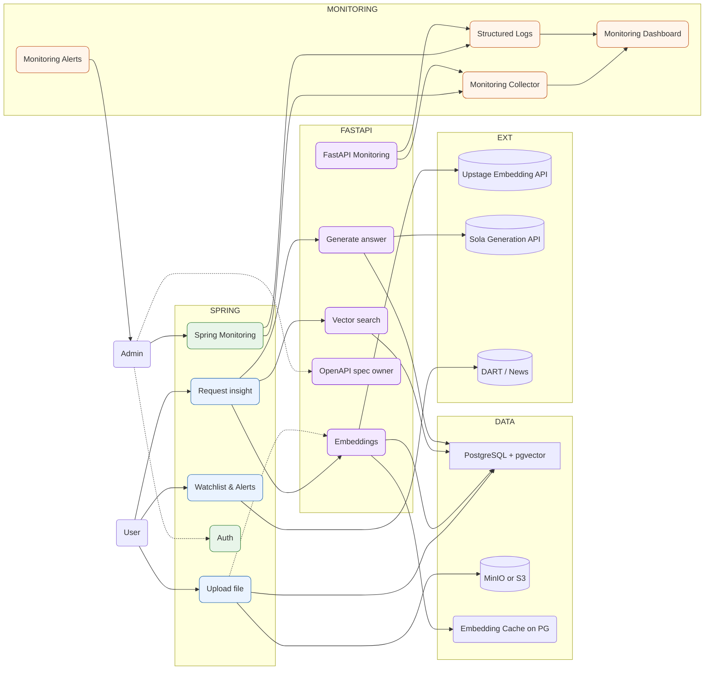

# FinNAI(Financial Navigator AI)

최근 금융 시장에 대한 관심이 높아지면서 주식 투자에 참여하는 개인 투자자가 급증하고 있습니다. 하지만 많은 초보 투자자들이 방대한 기업 정보와 복잡한 재무 지표 앞에서 어려움을 겪으며 정보 불균형 문제에 직면하고 있습니다.

**MCP-Agent**는 DART(전자공시시스템)의 공식 보고서, 증권사 리포트, 실시간 뉴스 등 신뢰도 높은 데이터를 LLM(거대 언어 모델) 기술과 결합하여, 누구나 쉽게 기업을 분석하고 현명한 투자 결정을 내릴 수 있도록 지원하는 웹 애플리케이션입니다.

### 2. 프로젝트 목표

- **정보 불균형 해소:** 복잡하고 분산된 투자 정보를 한곳에 모아 AI 기반으로 요약 및 분석하여 제공함으로써, 초보 투자자도 쉽게 투자 접근성을 갖도록 합니다.
- **직관적인 투자 경험 제공:** 어려운 재무 지표와 보고서 내용을 시각화 자료와 쉬운 설명으로 풀어내어, 투자에 대한 진입 장벽을 낮춥니다.
- **실시간 시장 대응 지원:** 실시간 데이터 연동 및 알림 기능을 통해 사용자가 시장 변화에 신속하게 대응할 수 있도록 돕습니다.

### 3. 핵심 기능 (Use Cases)

1. **기업 보고서 분석 및 LLM 요약**
    - 사용자가 개인적으로 보유한 투자 보고서를 업로드하거나, DART의 공식 보고서를 직접 검색하여 분석을 요청할 수 있습니다.
    - LLM이 보고서의 핵심 내용(사업, 재무, 위험요인 등)을 자동으로 요약하여 빠르고 정확한 정보 파악을 돕습니다.
    - MCP-Agent: 전자공시(DART) 기반 기업 분석 및 투자 서포트 에이전트

2. **재무 지표 학습 및 분석 지원**
    - ROE, PER, PSR 등 초보자에게 어려운 재무 지표의 정의와 활용 가치를 알기 쉽게 설명합니다.
    - 특정 기업의 재무 지표를 동종 산업 평균 및 경쟁사와 비교 분석하여 객관적인 평가를 지원합니다.
3. **통합 정보 탐색: 증권사 리포트 및 최신 뉴스**
    - 여러 증권사 리포트와 실시간 뉴스를 한곳에서 통합 검색하고, LLM이 핵심 내용과 시장에 미칠 영향을 분석하여 제공합니다.
    - 다양한 정보 소스의 의견을 비교하여 종합적인 투자 인사이트를 얻을 수 있습니다.
4. **데이터 시각화 및 해석 제공**
    - 기업의 재무 추이, 경쟁사 비교 데이터 등을 직관적인 차트와 그래프로 시각화합니다.
    - LLM이 각 시각화 자료의 수치와 형태가 가지는 의미를 설명하여 사용자의 데이터 해석 능력을 향상시킵니다.
    - 예: "매출액 상승 그래프는 기업의 성장성을 나타내는 긍정적 신호입니다."
5. **실시간 주가 및 정보 변동 알림**
    - WebSocket API를 기반으로 관심 종목의 실시간 주가 변동 및 등락률을 제공합니다.
    - 중요 공시, 뉴스 속보 등 투자 판단에 영향을 미치는 정보 발생 시 즉각적인 알림을 전송합니다.

### 4. 기술 스택 (예상)

- **Backend**: `Node.js`, `Python`, `...`
- **Frontend**: `React`, `Vue.js`, `...`
- **Database**: `PostgreSQL`, `MongoDB`, `...`
- **AI/LLM**:
    - `LLM API` (OpenAI, Gemini, etc.)
    - `RAG (Retrieval-Augmented Generation)`: 정보의 신뢰성 및 정확도 강화
- **Real-time Communication**: `WebSocket`
- **Monitoring**: `Grafana`, `Prometheus`
- **Infrastructure**: `Docker`, `Kubernetes`, `AWS/GCP`

### 5. 프로젝트 관리

- **소스 코드 관리**: Git
- **브랜치 전략**: Git-flow 등 협업을 위한 브랜치 전략 수립
- **마일스톤 관리**: Gantt 차트, Jira, Notion 등을 활용한 일정 및 태스크 관리
- **커밋 메시지 규칙**: Conventional Commits 규칙을 따라 커밋 로그의 가독성 및 일관성 유지

### 6.로그인 및 회원가입

- 관심종목
- 관심기업 알림

아키텍쳐
